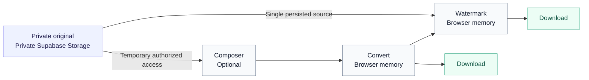
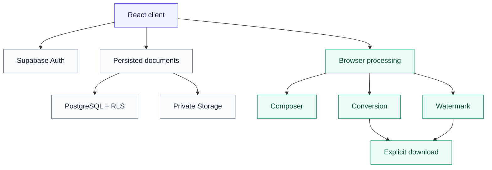

<div align="center">
  
  <h1>WatermarkMe</h1>
  <p><strong>Privacy-first document watermarking</strong></p>
  <h3>Protect your identity before sharing it.</h3>
  <p>
    Create purpose-specific copies of sensitive documents. Compose images and
    selected PDF pages, convert them into the format you need, apply a watermark,
    and download the result while every stored original remains unchanged.
  </p>
  <p>
    
    
    
    
  </p>
  <p>
    <a href="#why-watermarkme">Why WatermarkMe</a> ·
    <a href="#document-composer">Composer</a> ·
    <a href="#convert-to-the-format-you-need">Conversion</a> ·
    <a href="#purpose-specific-watermarking">Watermarking</a> ·
    <a href="#privacy-by-design">Privacy</a> ·
    <a href="#getting-started">Get started</a>
  </p>
</div>

<!--
PRODUCT SCREENSHOT: DASHBOARD / PRODUCT OVERVIEW

Recommended capture:
- authenticated dashboard
- several documents visible
- clean desktop viewport
- avoid DevTools/browser clutter

Suggested future path:
docs/screenshots/dashboard.png

Insert later with:

-->

## Built for safer sharing

<table>
  <tr>
    <td width="50%" valign="top">
      <strong>Private by design</strong><br />
      Stored originals stay in private, owner-scoped Storage. Generated conversion and watermark outputs stay in browser memory.
    </td>
    <td width="50%" valign="top">
      <strong>Originals stay untouched</strong><br />
      Composer, conversion, and watermarking always create separate output instead of modifying an uploaded source.
    </td>
  </tr>
  <tr>
    <td width="50%" valign="top">
      <strong>Compose only what is needed</strong><br />
      Combine images and selected PDF pages, leave out unnecessary content, and control the final order.
    </td>
    <td width="50%" valign="top">
      <strong>One continuous workflow</strong><br />
      Move from Compose → Convert → Watermark → Download without an intermediate download and re-upload.
    </td>
  </tr>
</table>

## Why WatermarkMe?

Identity and supporting documents are often shared for one specific purpose: a job application, bank verification, property rental, university admission, insurance, or another administrative request.

A generic copy does not explain why it was shared or who should use it. WatermarkMe creates a separate copy that can carry purpose, recipient, and date context—helping make the intended use explicit without changing the original document.

> [!NOTE]
> A watermark is context, not a guarantee against misuse. WatermarkMe is designed to make a copy's intended purpose clearer while preserving a privacy-first document workflow.

## How it works

1. **Upload a document** — keep one or more source files in a private logical document.
2. **Compose what you need** — select images or PDF pages and put them in the right order.
3. **Choose an output format** — generate PDF, PNG, or JPEG output in the browser.
4. **Add a purpose-specific watermark** — choose the purpose and recipient, then adjust its appearance.
5. **Download the generated copy** — save one file or a controlled ZIP for multiple outputs.

Composer and conversion are optional. A document with one persisted image or PDF source can open directly in the Watermark Editor.



Generated files are exposed outside the workflow only through an explicit download; they are not uploaded back to Supabase.

## Key features

### Secure document management

- Email/password authentication with confirmed-email access and protected routes
- Private source storage and owner-scoped document metadata
- Logical documents containing one or many source files
- Separate or combined multi-file uploads
- Add, remove, and reorder persisted sources
- Rename and delete documents with explicit confirmation
- Backward compatibility for legacy single-source documents and Storage paths

### Composition and preview

- Multiple images and independently selectable PDF pages
- Lazy PDF thumbnails and an active content preview
- Select or deselect individual items
- One ordered selection across images and pages from multiple sources
- Drag reordering plus keyboard-accessible **Move earlier** and **Move later** controls
- Mixed image and PDF-page composition for PDF output
- Session-local composition that does not rewrite persisted source order

### Conversion

- PDF, PNG, and JPEG output derived from the current selection
- Combined PDF or ordered multi-image output
- Individual multi-output downloads and one **Download all as ZIP** action
- Progress reporting, cancellation, retry, and stale-result protection
- Same-format PNG/JPEG pass-through where re-encoding is unnecessary
- Deterministic filenames and collision-safe ZIP contents

### Watermarking

- Six purpose presets: Job Application, Bank Verification, Property Rental, University Admission, Insurance, and Other
- Recipient or organization, editable watermark text, and an automatically included session date
- Opacity, rotation, relative size, and nine fixed positions
- Image and multi-page PDF preview and generation
- Shared-settings batch watermarking for generated image sets
- One ZIP download for a completed watermarked image batch

### Privacy safeguards

- Immutable-original workflow
- Browser-local generated and intermediate output
- Private Supabase Storage with temporary authorized source access
- PostgreSQL Row Level Security for owner isolation
- No frontend service-role credential
- No generated conversion or watermark upload

## Document Composer

Real documents are not always one file. An identity card may have a front and back, a supporting packet may contain several images, and a PDF may include pages that should not be shared.

The Composer turns each image and each PDF page into a selectable item. You can prepare examples such as:

- the front and back of an identity card;
- several supporting-document images;
- only selected pages from a PDF; or
- an image followed by selected PDF pages in one ordered document.

> [!IMPORTANT]
> Composer order is intentionally session-local. Reordering or deselecting items does not modify `document_files.sort_order`, stored source files, or source metadata.

<!--
PRODUCT SCREENSHOT: DOCUMENT COMPOSER

Recommended capture:
- document with multiple sources
- ideally image + multi-page PDF
- several selected items
- visible preview
- visible selected order
- demonstrate reordered content

Suggested future path:
docs/screenshots/document-composer.png

Insert later with:

-->

## Convert to the format you need

Conversion follows the exact current Composer selection and order. The interface derives compatible targets from that selection, so unsupported formats are not presented as actions that fail later.

| Selection | PDF | PNG | JPEG |
| --- | --- | --- | --- |
| Single image | ✅ | ✅ | ✅ |
| Multiple images | ✅ Combined PDF | ✅ Multiple files | ✅ Multiple files |
| Selected PDF pages | ✅ | ✅ Multiple files | ✅ Multiple files |
| Images + PDF pages | ✅ | — | — |

For PNG or JPEG multi-output, each artifact has its own download action and **Download all as ZIP** creates one archive through a single user action. PNG → PNG and JPEG → JPEG items pass through unchanged when possible, so a mixed image batch only re-encodes mismatched formats. Transparent PNG content converted to JPEG is composited onto a white background with a visible lossy/alpha warning.

Mixed image and PDF-page selections intentionally remain PDF-only. Selected PDF pages are copied natively into PDF output, while PDF → PNG/JPEG uses browser-side PDF.js rasterization.

<!--
PRODUCT SCREENSHOT: CONVERSION RESULT

Recommended capture:
- two selected images converted to PNG or JPEG
- result shows multiple generated files
- individual Download buttons visible
- Download All / ZIP visible
- Continue to Watermark visible

Suggested future path:
docs/screenshots/conversion-result.png

Insert later with:

-->

## Purpose-specific watermarking

Choose one of the built-in purposes, identify the recipient or organization, and refine the generated text. The current session date is included automatically. Appearance controls cover opacity, rotation, relative size, and nine positions, with a preview before generation.

Converted output can continue directly into the Watermark Editor through an authenticated, session-owned in-memory handoff—no intermediate download or re-upload is needed.

- **Multiple generated images:** one shared watermark configuration is applied to every artifact in order, and the completed files download together as one ZIP.
- **Generated PDF:** the PDF remains a PDF and uses the native PDF watermark path rather than being converted into page images.
- **Persisted single source:** images and PDFs can still enter watermarking directly without Composer.

<!--
PRODUCT SCREENSHOT: WATERMARK EDITOR

Recommended capture:
- visible document preview
- purpose selector
- recipient
- watermark controls
- visible watermark on preview
- if possible use a multi-image generated result so Previous/Next or
  batch state is visible

Suggested future path:
docs/screenshots/watermark-editor.png

Insert later with:

-->

## Privacy by design

WatermarkMe separates persisted private originals from temporary generated output:

| Data | Location | Lifecycle |
| --- | --- | --- |
| Original source files | Private Supabase Storage | Persist until the owner removes the source or document |
| Document/source metadata | Supabase PostgreSQL with RLS | Persist for the authenticated owner |
| Generated conversion output | Browser memory | Session-local; cleared when invalidated or the session is lost |
| Generated watermark output | Browser memory | Available for explicit local download; not uploaded |

> [!IMPORTANT]
> **Generated conversion and watermark outputs stay local to the browser.** Stored originals may be uploaded to private Supabase Storage, so WatermarkMe does not make the inaccurate claim that source files never leave the device.

Confirmed architectural invariants:

- Composer, conversion, and watermarking never overwrite an original.
- Generated output is not uploaded to Supabase Database or Storage.
- The `documents` bucket is private.
- Database and Storage policies enforce authenticated-owner isolation.
- The frontend uses only the Supabase project URL and anon key—never a `service_role` key.
- Stored originals are loaded through temporary authorized access when browser processing needs them.
- Converter → Watermark handoff keeps generated `Blob` artifacts in JavaScript memory and passes only an opaque identifier through navigation state.
- Refresh or an authenticated-user change intentionally expires the temporary handoff instead of falling back to a stored original.

## Supported files

| Type | Input | Generated output |
| --- | --- | --- |
| JPEG | ✅ | ✅ |
| PNG | ✅ | ✅ |
| PDF | ✅ | ✅ |
| ZIP | — | Multi-file download only |

Each uploaded source must be non-empty and no larger than **10 MiB**. ZIP is a download package, not an upload or Composer source format.

## Architecture

### Frontend

- React 19, TypeScript, and React Router
- Vite 8 and Tailwind CSS 4

### Platform

- Supabase Auth
- PostgreSQL with Row Level Security
- Private Supabase Storage

### Browser processing

- Canvas for image conversion and watermark rendering
- `pdf-lib` for PDF composition and watermark generation
- Lazy-loaded `pdfjs-dist` for PDF previews and page rasterization
- Lazy-loaded JSZip for controlled multi-file downloads



Generated artifacts flow through the browser-processing branch only; they do not flow back into persisted documents.

## Technical highlights

| Engineering decision | Why it matters |
| --- | --- |
| **Multi-source logical documents** | Expands the original one-file model without moving or rewriting legacy Storage objects. |
| **Source-scoped PDF page identity** | Keeps page identity stable across multiple PDFs, selection changes, and arbitrary ordering. |
| **Native mixed PDF composition** | Copies selected PDF pages directly while creating new pages only for images. |
| **Ordered multi-artifact output** | Keeps every generated image traceable to its Composer item with deterministic, collision-safe names. |
| **In-memory workflow handoff** | Makes converted bytes authoritative in the Watermark Editor without `localStorage`, IndexedDB, or Supabase persistence. |
| **Owner-enforced isolation** | Protects logical documents and source objects with RLS and private Storage policies beyond frontend filtering. |
| **Cancellation and cleanup** | Aborts stale work and releases temporary object URLs, canvases, and PDF resources. |
| **Release regression suite** | Exercises legacy compatibility, conversion order, stale results, ZIP safety, handoff ownership, and watermark rendering. |

## Getting started

### Requirements

- Node.js `^20.19.0` or `>=22.12.0` (the supported range for the installed Vite version)
- npm
- A hosted Supabase project

### Clone

```bash
git clone https://github.com/FrhnSpwli/watermark-me.git
cd watermark-me
```

### Install

```bash
npm install
```

### Environment

Create `.env.local` in the project root:

```env
VITE_SUPABASE_URL=
VITE_SUPABASE_ANON_KEY=
```

Use the project URL and anon key from your Supabase project. Do not add a service-role key or database password to frontend environment variables.

### Database and Storage

Apply the SQL files in [`supabase/migrations`](supabase/migrations) in timestamp order through the Supabase SQL Editor. The repository is not currently linked to a Supabase CLI project. Follow [`supabase/README.md`](supabase/README.md) for the migration order, private bucket expectations, and post-migration checks.

For local authentication, enable email confirmation and configure:

- Site URL: `http://localhost:5173`
- Redirect URL: `http://localhost:5173/auth/confirm`

Add the equivalent production origin and `/auth/confirm` redirect before deployment.

### Development

```bash
npm run dev
```

Vite uses `http://localhost:5173` by default unless that port is unavailable.

### Validation

```bash
npm run lint
npm run typecheck
npm run test
npm run build
npm audit --audit-level=high
```

## Project status

| Release | Implementation | Acceptance | Hardening |
| --- | --- | --- | --- |
| **WatermarkMe v0.2 — Document Composer & Converter** | ✅ Complete | ✅ Complete | ✅ Complete |

Release highlights include multi-source private documents, image/PDF composition, browser-local conversion, controlled multi-file output, purpose-specific watermarking, and direct in-memory conversion → watermark handoff.

See [`ROADMAP.md`](ROADMAP.md) for development chronology. The active v0.2 architecture and behavior are documented in [`V0.2_DOCUMENT_COMPOSER.md`](V0.2_DOCUMENT_COMPOSER.md).

## Documentation

| Document | Description |
| --- | --- |
| [`MVP_BUILD_SPEC.md`](MVP_BUILD_SPEC.md) | Original v0.1 MVP specification |
| [`V0.2_DOCUMENT_COMPOSER.md`](V0.2_DOCUMENT_COMPOSER.md) | v0.2 as-built Composer & Converter specification |
| [`ROADMAP.md`](ROADMAP.md) | Development roadmap and phase history |
| [`PHASE17_RELEASE_ACCEPTANCE.md`](PHASE17_RELEASE_ACCEPTANCE.md) | Release QA, security, privacy, and browser acceptance runbook |

## Release snapshot

| Regression checks | Production build | High-severity audit findings |
| ---: | :---: | ---: |
| **577 passing** | **Passing** | **0** |

## Roadmap

WatermarkMe v0.2 is complete. Future work is intentionally not committed to a new release scope; see [`ROADMAP.md`](ROADMAP.md) for documented candidates and project history.

---

<p align="center">
  Built as a privacy-first document workflow · Maintained by
  <a href="https://github.com/FrhnSpwli">FrhnSpwli</a>
</p>
